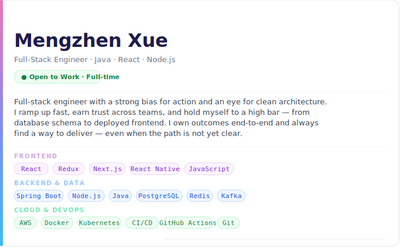

<!-- Upload mengzhen_banner.svg to your profile repo root -->

---

## Experience

**IpserLab, LLC** · Software Engineer Intern `Sep – Dec 2025 · Fort Worth, TX`

- Built full-stack real estate marketplace platform with 20+ RESTful APIs using Java and PostgreSQL, supporting property listings, search, and transaction workflows
- Designed property search API with 6 filter parameters, architected to handle 1000+ concurrent listings
- Designed PostgreSQL schema with 4 normalized tables managing one-to-many and many-to-many relationships
- Built responsive React + Redux frontend with 10 reusable components across 5 core pages, reducing dev time by 15%; deployed on AWS EC2 with cross-platform React Native mobile app

---

## Selected Projects

**[🎟️ Event Ticket Booking Platform](https://github.com/Mengzhen-Xue/event-booking)**
Spring Boot RESTful APIs for event management and seat allocation with role-based access control for 3 user types. PostgreSQL schema with optimistic locking to prevent ticket overselling. QR code ticket validation, deployed on AWS Lightsail, React dashboard with real-time sales analytics.
`Spring Boot` `PostgreSQL` `React` `AWS` `JWT`

**[🛒 Organic Food Shopping Platform](https://github.com/Mengzhen-Xue/Origanic-food-Market.git)**
Full-stack e-commerce with Next.js SEO-optimized frontend and Node.js/Express backend. WebSocket for real-time order and delivery updates, Redux state management, JWT auth, role-based admin panel with server-side input validation.
`Next.js` `Node.js` `Redux` `WebSocket` `JWT`

---

## GitHub Stats

---

## Let's Talk

I'm actively interviewing and happy to connect — whether it's a role, a referral, or just a conversation about something interesting you're building.

📬 **[xue.mengz08@gmail.com](mailto:xue.mengz08@gmail.com)** · 💼 **[linkedin.com/in/mengzhen-xue](https://linkedin.com/in/mengzhen-xue)** · 🌐 **[Portfolio coming soon](https://YOUR_PORTFOLIO)**

*I read every message and usually reply within 24 hours.*

---

*Last updated: 2025 · still building, always learning.*

